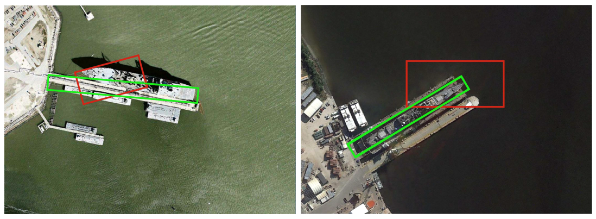
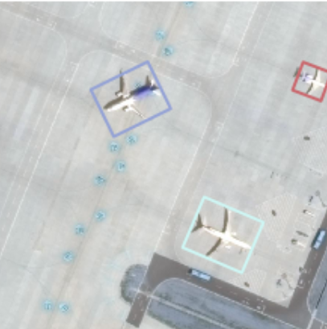

# DAL-Paddle
## 目录

- [1. 简介](#1)
- [2. 数据集和复现精度](#2)
- [3. 准备数据与环境](#3)
  
    - [3.1 准备环境](#31)
    - [3.2 准备数据](#32)
    - [3.3 准备模型](#33)
- [4. 代码结构说明](#4)
- [5. 开始使用](#5)
  - [5.1 模型训练](#51)
  - [5.2 模型预测](#52)
  - [5.4 模型导出(动转静)](#53)
  - [5.5 模型推理(inference)](#54)
- [6. 自动化测试脚本](#6)
- [7. LICENSE](#7)
- [8. 参考链接与文献](#8)

<a name="1"></a>

## 1. 简介
论文《[Dynamic Anchor Learning for Arbitrary-Oriented Object Detection](https://arxiv.org/abs/2012.04150)》提出了一种对于遥感图像的旋转目标检测方法，作者提出了主要对于锚框质量的评估与损失函数的设计进行了精心设计。

<div align="center">
    
</div>

**论文:** [See Better Before Looking Closer: Weakly Supervised Data Augmentation Network for Fine-Grained Visual Classification](https://arxiv.org/pdf/1901.09891.pdf)

**参考repo:** [https://github.com/ming71/DAL](https://github.com/ming71/DAL)

在此非常感谢`ming71`贡献的[DAL](https://github.com/ming71/DAL)，提高了本repo复现论文的效率。

**AI Studio体验教程:** [运行一下](https://aistudio.baidu.com/aistudio/projectdetail/3948557?contributionType=1&shared=1) （已挂载相关数据集，省去修改路径步骤，模型测试、训练直接运行！）

**Github复现地址:** [点击查看](https://github.com/Victory8858/DAL-Paddle)

<a name="2"></a>

## 2. 数据集和复现精度

论文中采用的数据集之一为[DOTA](https://captain-whu.github.io/DOTA/dataset.html)数据集，该数据集为高分辨率的遥感图像，数据集可在官网下载，本repo的复现精度如下，可下载训练好的模型（链接：https://pan.baidu.com/s/1YX9ttIQsof09fx-Cc-ubcA  提取码：1234） 

注意：训练时采用Train+Val进行训练，测试时需要到官网的[指定入口](http://bed4rs.net:8001/evaluation1)进行提交

Dataset | Train | Val | Test | mAP(复现)   | mAP(原论文) 
:-:|:-: |:-: |:-: |:-: |:-:
[DOTA](https://captain-whu.github.io/DOTA/dataset.html) | 1411 | 458 | 937 | 71.42 | 71.44 

<a name="3"></a>

## 3. 准备数据与环境

<a name="31"></a>

### 3.1 准备环境

PaddlePaddle == develop版本
Cython == 0.29.17
imgaug == 0.4.0
ipdb

在AI Studio中，您可通过如下命令一件配置：

```shell
!mkdir /home/aistudio/external-libraries
!pip install Cython==0.29.17 -t /home/aistudio/external-libraries
!pip install imgaug==0.4.0 -t /home/aistudio/external-libraries
!pip install ipdb -t /home/aistudio/external-libraries
```

此外，您需要编译Cython和CUDA的一些模块：
```
cd $ROOT/utils
sh make.sh
cd $ROOT/utils/overlaps_cuda
python setup.py build_ext --inplace
```
Installation for DOTA_devkit:
```
cd $ROOT/datasets/DOTA_devkit
sudo apt-get install swig
swig -c++ -python polyiou.i
python setup.py build_ext --inplace
```

<a name="32"></a>

### 3.2 准备数据

对于DOTA数据集，其原图像尺寸在800×800~4000×13000像素之间，所以在训练时，采用离线裁剪的策略，即预先利用官方提供的数据集裁剪API进行处理，得到800×800的图像，程序如下：
#### 3.2.1 训练集切割
```python
from ImgSplit import splitbase
# 切割1411张train图片
split = splitbase('/home/aistudio/data/DOTA/train',  # dataset ready to split
                  '/home/aistudio/data/DOTA/trainsplit',  # where to save the splited images
                  gap=200,
                  subsize=800)
split.splitdata(1)

# 切割458张train图片
split = splitbase('/home/aistudio/data/DOTA/val',  # dataset ready to split
                  '/home/aistudio/data/DOTA/valsplit',  # where to save the splited images
                  gap=200,
                  subsize=800)
split.splitdata(1)
```

**提示：若直接利用上述AI Studio链接中的数据集，便可省去训练集切割操作，测试集仍需切割**

#### 3.2.2 测试集切割

```python
# 切割937张test图片
import sys 
sys.path.append('/home/aistudio/work/DAL/datasets/DOTA_devkit')
from SplitOnlyImage_multi_process import splitbase
split = splitbase(r'/home/aistudio/data/DOTA/test/images',     # dataset ready to split
                r'/home/aistudio/data/DOTA/testsplit/images',  # where to save the splited images
                gap=200,
                subsize=800)
split.splitdata(1)
```
#### 3.2.3 数据集路径生成

数据集中图片经切割后，会生成对应的split文件夹，如`trainsplit`，`valsplit`，`testsplit`，然后运行`datasets`文件夹下的`generate_imageset.py`文件，生成训练时需要的图片路径`.txt`文件：
```shell
python datasets/generate_imageset.py --train-img-path="/home/aistudio/data/DOTA/trainsplit/images"
									 --val-img-path="/home/aistudio/data/DOTA/valsplit/images"
    								 --save-dir="/home/aistudio/data/DOTA"
    								 --mode="trainval"
```
参数说明如下：
```txt
--train-img-path：train数据集经过切割后的图片文件夹路径
--val-img-path：val数据集经过切割后的图片文件夹路径
--save-dir：图片路径.txt文件保存路径
--mode：trainval、train、val（全量训练时选择trainval模式）
```


上述步骤完成后，数据集总的目录结构如下所示：

```shell
DOTA
├── trainsplit
    ├── images
    ├── labelTxt
├── valsplit
    ├── images
    ├── labelTxt    
├── testsplit
    ├── images
    ├── labelTxt
├── val
    ├── images
    ├── labelTxt
├── test
    ├── images
├── trainval.txt  # 训练集图片路径
├── val.txt		  # 验证集图片路径
```

<a name="4"></a>

## 4. 代码结构说明

```shell
DAL
├── README.md  # 用户指南
├── tiny_dataset   # 轻量级数据集
├── tiny_datasetsplit   # 轻量级数据集
├── datasets   # 各种数据集定义读取文件夹
	├── DOTA_devkit     # 官方提供的数据处理相关文件
    ├── dota_dataset.py # DOTA数据集读取
    ├── collater.py     # 图片填充以及真实框的处理
    ├── generate_imageset.py  # 生成数据集中所有图片的路径
    
├── models  # 模型相关文件
    ├── model.py   # DAL模型
    ├── fpn.py     # FPN结构
    ├── anchors.py # 锚框生成
    ├── heads.py   # 检测头:分类与回归相关函数
    ├── loss.py    # 损失函数相关计算
├── test_tipc  # TICP 
	├──	  # 具体见TICP部分文档
├── outputs  # 输出的检测框信息（merged文件夹打包后提交官网） 
├── utils  # 一些工具（nms等）
├── train.py     # 模型训练
├── val.py       # 模型测试
├── infer.py     # 模型推理
├── export_model.py  # 模型导出
├── predicted.py # 单张图片预测
└── imgs         # Markdown 图片资源
```

<a name="5"></a>

## 5. 开始使用

在开始训练前，假如您已经按上述操作准备好了相关数据集以及相应配置，下面即可进行训练、测试。

<a name="51"></a>

### 5.1 模型训练

```shell
bash train.sh
# 或在DAL目录下
python train.py --train-path="/home/aistudio/work/DAL/tiny_datasetsplit/train.txt" --test-path="/home/aistudio/work/DAL/tiny_dataset" --save-path="/home/aistudio/work/DAL/log" --epochs=10 --batch-size=4 --test_interval=2 --save_interval=5
```
以上为小批量tiny数据的训练模式，若想启用全量训练，请修改参数如下：

```shell
--train-path="/home/aistudio/data/DOTA/trainval.txt" ## 修改为全量训练图片的.txt文件路径
--test-path="/home/aistudio/work/DAL/tiny_dataset"   ## 可不修改，为观察训练过程中的mAP变化情况，也可将路径改为"/home/aistudio/data/DOTA/val"，即可在验证集上进行测试
--save-path="/home/aistudio/work/DAL/log"            ## 不用改动
--epochs=130          ## 全量训练epoch为130
--batch-size=8        ## 全量训练batch_size为8
--test_interval=2     ## 训练多少轮验证一次，可根据实际情况修改
--save_interval=5     ## 训练多少轮保存一次模型，可根据实际情况修改
```


<a name="52"></a>

### 5.2 模型预测

`test_path`为测试的数据集路径（未经切割的），实际会自动测试切割好的split数据集，
`weight_path`为模型的路径，即期望利用哪个模型进行预测推理
`conf`为一个阈值，越小预测推理时间越慢，mAP也会稍有上升

```shell
bash val.sh
# 或在DAL目录下
python val.py --test-path="/home/aistudio/work/DAL/tiny_dataset" 
			  --weight-path="/home/aistudio/weights/model_93.pdparams"
			  --conf=0.1
```
当预测测试集时不会产生mAP的结果，只会产生对应的输出文件，因为测试集无标注信息，没有参考，在`DAL/outputs`路径下会产生三个文件夹，第一个是`detections`，为切割后的800*800每一张小图的预测结果，第二个是`integrated`，为每一个大图的所有预测结果，第三个`merged`，为所有目标框信息按类别分类的.txt文件，最后需将`merged`文件夹压缩后提交至[DOTA v1 evaluation入口](http://bed4rs.net:8001/evaluation1/)进行结果测试。 

<a name="54"></a>

### 5.3 模型导出
`export_model.py`为模型导出文件，可以将训练好的`*.pdparams`模型进行动转静，运行方式如下：

```shell
python export_model.py --model-path="/home/aistudio/weights/last.pdparams"
```

<a name="54"></a>

### 5.4 模型推理(inference)
infer.py为模型推理文件，输入一张图片利用静态模型进行推理，得到相应的物体框四点坐标，本文件在TIPC中会用到，任意输入一张图片，其推理结果如下图所示，输出坐标信息，并将检测框绘制到原图片上并保存。

<div align="center">
    
</div>

您可通过如下方式运行：


```shell
python --infer.py --model-dir="export_model"
   			      --img-path="tiny_datasetsplit/images/P0000__1__2400___3600.png"
```

<a name="6"></a>

## 6. TIPC自动化测试脚本

TIPC命令如下，执行完后根目录内会生成log文件夹，为运行结果的日志，详见TIPC文档:

```shell
bash test_tipc/test_train_inference_python.sh test_tipc/configs/DAL/train_infer_python.txt lite_train_lite_infer
```

<a name="7"></a>

## 7. LICENSE

[Apache 2.0 license](./LICENSE)

<a name="8"></a>

## 8. 参考链接与文献

- [https://github.com/ming71/DAL](https://github.com/ming71/DAL)